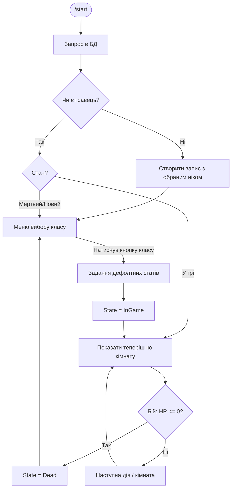
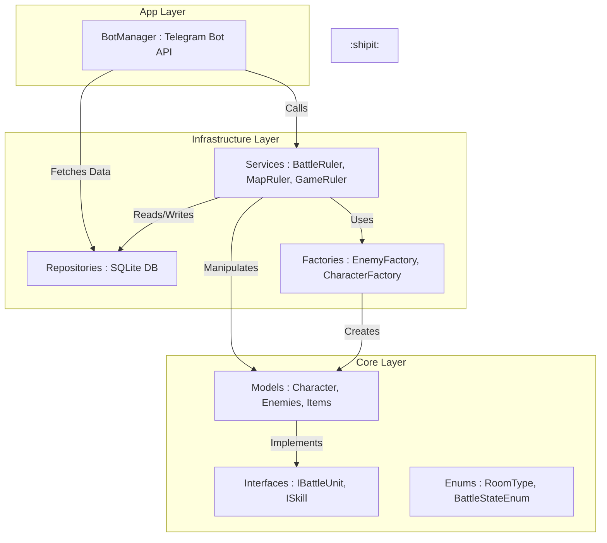
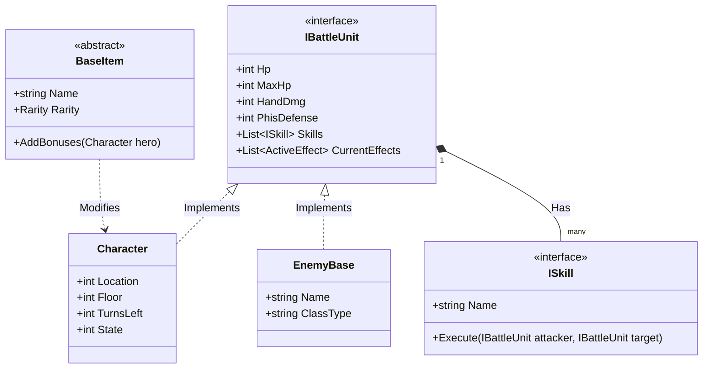
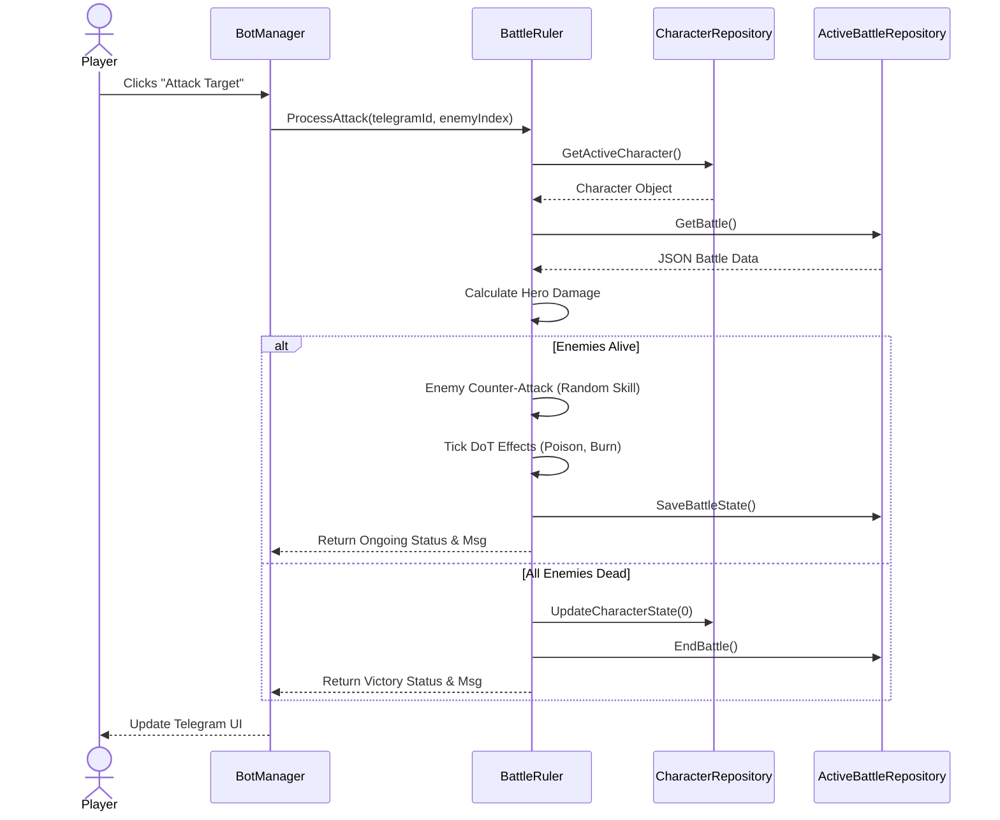

# Базова інформація про проєкт
Назва: `Deep Inside`  
Виконавці: `Солопов Данило та Рибаков Ігор.`

Цей проєкт являє собою телеграм бота з [rougelike](https://uk.wikipedia.org/wiki/Roguelike) грою в якій ви за шукача пригод відправляєтеся в глибоке підземелля, яке являє собою величезний замок, щоб дістати артефакт який у вас замовив містичний чоловік із таверни.

Ваша задача пройти через підземелля та витягти звідти той артефакт, але це не буде так просто з двох причин: 
```
1. Це багаторівневе підземелля із смертельними ворагами всередині  
2. За вами постійно женется невідома істота
``` 

Чи зможете ви повернутися залежить тільки від вас, вдачі та обізнаності на підземеллі.


# Структура гри


У грі буде 3 локації:
```
1. Найвища башня замку [🏰]
2. Тронна зала [👑]
3. Підземна в'язниця [💀]
```

На кожній локації буде по три рівні та три вороги:
```
На першій локації - маги
На другій локації - королівські вартові
На третійц - в'язні які перетоврилися на зомбі та скелетів
```


Гравець може посилюватися підіймаючи рівень після боїв або знаходячи предмети на локаціях. Загалом заплановано не менше 10 предметів.

Після проходження третьої локації гравець потрапляє на арену з фінальним босом.

На кожному рівні локації у гравця буде обмежена кількість ходів через те що за гравцем постійно женеться звір.  
Якщо ходи вичерпано, то гра завершується програшем гравця.  
Після виходу з локації рахунок ходів скидається.
# Графічне уявлення взаємодії користувача із ботом

# Архітектура проекта


# Діаграмма класів


# Діаграма послідовності

